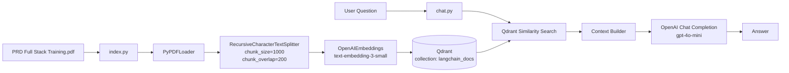
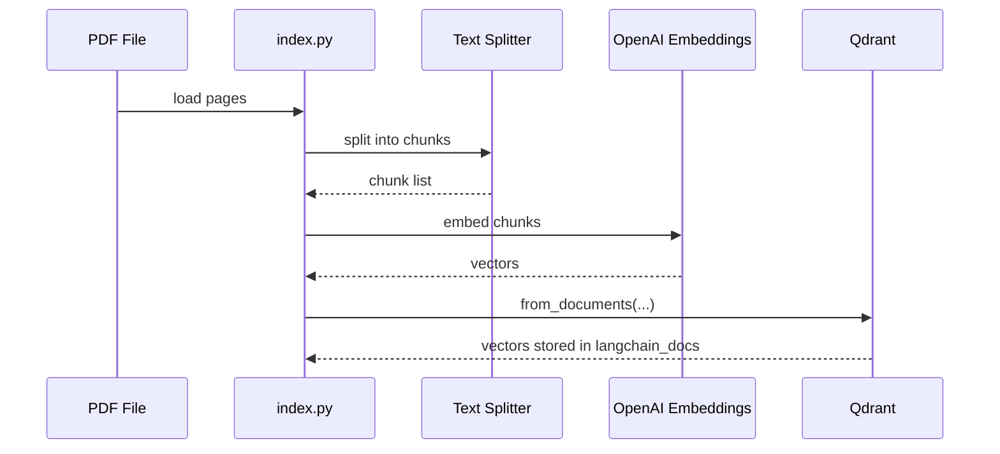
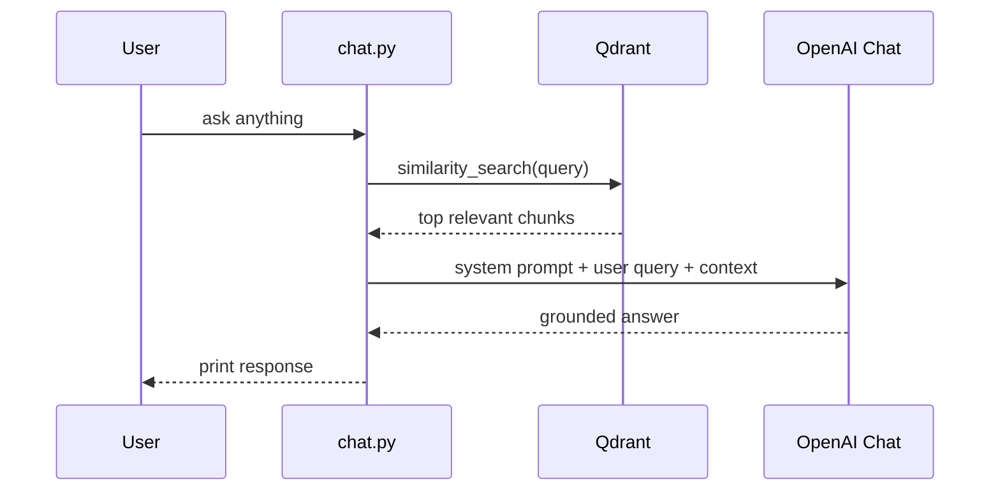

# RAG Project (PDF Q&A with Qdrant + OpenAI)

This project is a lightweight Retrieval-Augmented Generation (RAG) system that:

- reads a local PDF,
- splits it into chunks,
- generates embeddings,
- stores vectors in Qdrant,
- retrieves relevant chunks for a user question,
- asks an OpenAI chat model to answer using only retrieved context.

## What This Repository Contains

- `index.py`: Ingestion and indexing pipeline (PDF -> chunks -> embeddings -> Qdrant)
- `chat.py`: Retrieval and answer generation pipeline (query -> similarity search -> LLM answer)
- `docker-compose.yml`: Local Qdrant service
- `requirements.txt`: Python dependency lock list
- `PRD Full Stack Training.pdf`: Source document used for indexing

## High-Level Architecture



## Pipeline 1: Ingestion and Indexing

Implemented in `index.py`.

1. Load environment variables via `load_dotenv()`.
2. Open local PDF `PRD Full Stack Training.pdf` using `PyPDFLoader`.
3. Split document into overlapping chunks:
   - `chunk_size=1000`
   - `chunk_overlap=200`
4. Create embeddings with `text-embedding-3-small`.
5. Upsert all chunk vectors into Qdrant collection `langchain_docs` at `http://localhost:6333`.
6. Print completion message.

### Ingestion Data Flow



## Pipeline 2: Retrieval and Generation

Implemented in `chat.py`.

1. Load environment variables.
2. Connect to existing Qdrant collection `langchain_docs`.
3. Read user query from terminal input.
4. Run `similarity_search(query=user_query)`.
5. Build prompt context from retrieved chunks.
6. Send system prompt + user query to OpenAI chat model (`gpt-4o-mini`).
7. Print assistant answer.

### Query Data Flow



## Prerequisites

- Python 3.10+
- Docker Desktop (or Docker Engine)
- OpenAI API key

## Setup

### 1) Create and activate virtual environment

Windows PowerShell:

```powershell
python -m venv venv
.\venv\Scripts\Activate.ps1
```

### 2) Install dependencies

```powershell
pip install -r requirements.txt
```

### 3) Configure environment

Create `.env` in project root:

```env
OPENAI_API_KEY=your_openai_api_key_here
```

### 4) Start Qdrant

```powershell
docker compose up -d
```

Qdrant endpoint used by code: `http://localhost:6333`

## Run Order

1. Run indexing first (one time, or whenever source PDF changes):

```powershell
python index.py
```

2. Run chat query loop script:

```powershell
python chat.py
```

3. Enter question when prompted by `ask anything:`.

## Current Technology Choices

- Vector store: Qdrant (self-hosted via Docker)
- Embedding model: `text-embedding-3-small`
- Generation model: `gpt-4o-mini`
- RAG framework components: LangChain loaders/splitters/vector integration

## Project Configuration Details

- Qdrant collection name: `langchain_docs`
- Qdrant URL: `http://localhost:6333`
- Chunking strategy:
  - size: 1000
  - overlap: 200
- Source document path is relative to script location.

## Operations and Deployment Notes

### Local runtime pipeline

This repository currently uses a local/manual pipeline:

1. Start infrastructure with Docker Compose.
2. Run ingestion script.
3. Run query script.

There is no CI/CD pipeline configuration yet (no GitHub Actions/Azure DevOps/GitLab CI files in repository at this time).

### Suggested CI pipeline (optional future enhancement)

A minimal CI pipeline could include:

1. Setup Python
2. Install dependencies
3. Lint/format checks
4. Smoke test that modules import successfully

A minimal CD pipeline could include:

1. Build a runtime container for app scripts
2. Deploy Qdrant and app to target environment
3. Run post-deploy health checks

## Known Issues and Improvement Opportunities

1. `chat.py` accesses metadata key `page_lable`, which may be a typo depending on loader output and can cause a `KeyError`.
2. `index.py` prints `docs[2]`; this may fail for PDFs with fewer than 3 pages and is usually debug-only output.
3. Retrieval call uses default `similarity_search` settings; adding explicit `k` can improve predictability.
4. No automated tests are included yet.
5. The project relies on a single PDF file path hardcoded in code.

## Security Note

- Keep `.env` out of version control and never commit real API keys.
- If a key is exposed accidentally, rotate it immediately.

## Quick Troubleshooting

- If Qdrant connection fails:
  - verify `docker compose up -d` is running
  - verify port `6333` is free and mapped
- If OpenAI calls fail:
  - verify `.env` exists with valid `OPENAI_API_KEY`
  - confirm your account has model access
- If retrieval is poor:
  - rerun `python index.py`
  - tune chunk size/overlap

## Future Enhancements

1. Add structured logging and error handling.
2. Add tests for indexing and retrieval stages.
3. Add CLI arguments for PDF path, collection name, and top-k retrieval.
4. Add reranking for better context quality.
5. Add API service layer (FastAPI/Flask) for production usage.
